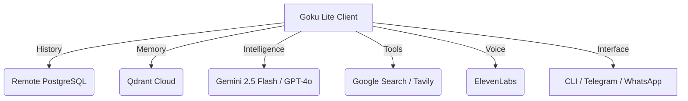

# 🐉 Goku Lite: The Cloud-Native Orchestrator

> **"Power over Bloat. Intelligence over Infrastructure."**

Goku Lite is a high-performance, cloud-native AI agent designed to run on ultra-low resource environments (like AWS `t3.micro`) by offloading all state, memory, and heavy intelligence to the cloud. 

[](https://opensource.org/licenses/MIT)
[](https://www.python.org/)
[](https://deepmind.google/technologies/gemini/)

---

## ⚡ One-Liner Installation

Install Goku Lite as a global system command in seconds:

```bash
curl -sSL https://raw.githubusercontent.com/elvisthebuilder/goku_lite/main/install.sh | sudo bash
```

---

## 🏗️ Cloud-Native Architecture

Goku Lite is stateless. Your host machine stays clean while Goku wields infinite power from the cloud.



## 🌟 Key Features

- **🚀 2.5 Flash Intelligence**: Powered by the latest Gemini 2.5 Flash for near-instant responses.
- **🧠 Vector Memory**: Long-term recall via Qdrant Cloud.
- **📁 Terminal Agency**: Full File System and Bash execution capabilities.
- **🌐 Native Grounding**: Built-in Google Search via Gemini for real-time facts.
- **🎙️ ElevenLabs Voice**: High-fidelity voice notes on Telegram and WhatsApp.
- **📄 Multimodal**: Ingest PDFs, DOCX, Images, and Voice Notes instantly.

---

## 📱 Usage & Management

### Background Operation (Production)
Goku Lite runs as a system service. Use these commands to manage the orchestrator:

- **`goku-lite-start`**: Start the background orchestrator.
- **`goku-lite-stop`**: Stop the background orchestrator.
- **`goku-lite-restart`**: Restart the orchestrator (use after config changes).
- **`goku-lite-logs`**: Watch real-time logs to see Goku's thoughts.

### 🚀 Management Toolkit
Goku Lite comes with a built-in suite of global commands for easy management:

| Command | Description |
| :--- | :--- |
| `goku-lite-help` | Show all available commands |
| `goku-lite-cli` | Open the interactive chat terminal (Shortcut: `goku`) |
| `goku-lite-update` | Pull the latest features and refresh dependencies |
| `goku-lite-setup` | Reconfigure LLM, DB, or Cloud keys |
| `goku-lite-total-reset` | Wipe all history and memories (Tabula Rasa) |
| `goku-lite-start/stop` | Control the background orchestrator service |

---

### 🔄 Updating
If you are an existing user, you can upgrade to the latest version by running:
```bash
sudo git pull origin main
sudo ./install.sh
```
*(This will preserve your .env configuration while registering all new global commands.)*

### 🏗️ Interactive Terminal
- **`goku-lite-cli`**: Enter the high-fidelity terminal chat (Shortcut: `goku`).

### ⚙️ Configuration
- **`goku-lite-setup`**: Run the onboarding wizard to link cloud services.

### Messaging
- **Telegram**: Interact with your bot 24/7. Use `[voice]` to get a voice response.
- **WhatsApp**: Direct access to your orchestrator via mobile chat.

---

## 🤝 Contribution
Goku Lite is an open-source project. Feel free to submit PRs for new Tools, Interfaces, or Cloud integrations.

---

## 📜 Acknowledgements
Goku Lite is built on the architectural philosophy and "Self-Becoming" principles of **[OpenClaw](https://github.com/OpenClaw)**. It aims to be a lightweight, cloud-native implementation of the OpenClaw agent stack.

**Built with ⚡ by Elvis The Builder.**
