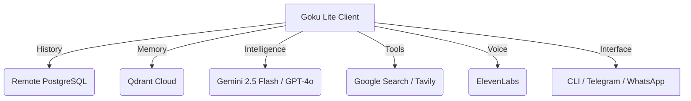

# 🐉 Goku Lite: The Cloud-Native Orchestrator

> **"Power over Bloat. Intelligence over Infrastructure."**

Goku Lite is a high-performance, cloud-native AI agent designed to run on ultra-low resource environments (like AWS `t3.micro`) by offloading all state, memory, and heavy intelligence to the cloud. 

[](https://opensource.org/licenses/MIT)
[](https://www.python.org/)
[](https://deepmind.google/technologies/gemini/)

---

## ⚡ One-Liner Installation

Install Goku Lite as a global system command in seconds:

```bash
curl -sSL https://raw.githubusercontent.com/elvisthebuilder/goku_lite/main/install.sh | sudo bash
```

---

## 🏗️ Cloud-Native Architecture

Goku Lite is stateless. Your host machine stays clean while Goku wields infinite power from the cloud.



## 🌟 Key Features

- **🚀 2.5 Flash Intelligence**: Powered by the latest Gemini 2.5 Flash for near-instant responses.
- **🧠 Vector Memory**: Long-term recall via Qdrant Cloud.
- **📁 Terminal Agency**: Full File System and Bash execution capabilities.
- **🌐 Native Grounding**: Built-in Google Search via Gemini for real-time facts.
- **🎙️ ElevenLabs Voice**: High-fidelity voice notes on Telegram and WhatsApp.
- **📄 Multimodal**: Ingest PDFs, DOCX, Images, and Voice Notes instantly.

---

## 🛠️ Setup & Configuration

After installation, simply run the global setup wizard:

```bash
goku-lite-setup
```

This will guide you through connecting your Cloud AI, Database, Memory, and Messaging channels.

---

## 📱 Multi-Channel Usage

### Global CLI
Once installed, just type:
```bash
goku-lite
```

### Messaging
- **Telegram**: Interact with your bot 24/7. Use `[voice]` to get a voice response.
- **WhatsApp**: Direct access to your orchestrator via mobile chat.

---

## 🤝 Contribution
Goku Lite is an open-source project. Feel free to submit PRs for new Tools, Interfaces, or Cloud integrations.

**Built with ⚡ by Elvis The Builder.**
